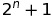
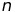
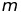
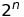
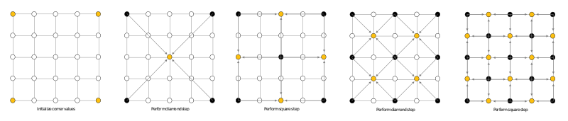
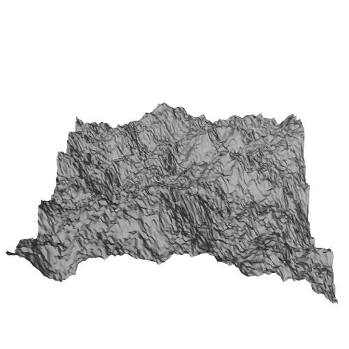
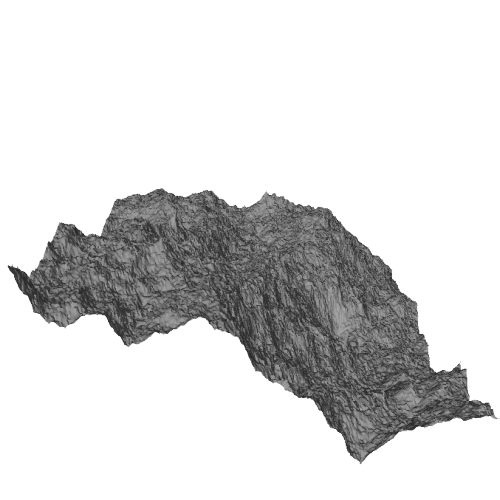

# Diamond-Square Algorithm

This is a C++ implementation of the diamond-square algorithm for terrain generation.

## Description

The algorithm starts with a 2D square matrix. The width (and height) of the matrix is given by , where  is a positive integer. The four corner vertices are set in the beginning of the algorithm. 

The main part of the algorithm contains 2 operations:
1. **Diamond** operation is performed in the following way. Mean value of the heights of the four corners of a square of size  is assigned to the middle vertex of a square and some random value is added.
2. **Square** operation is performed in the following way. Mean value of the heights of the four corners of a diamond of size  is assigned to the middle vertex of a diamond and some random value is added.

Diamond and square operations are executed  times with  halving after each pair of daimond and square operations.  is assigned to  in the beginning.

The visual representation of the algorithm (from [wikipedia](https://en.wikipedia.org/wiki/Diamond-square_algorithm)) is shown below.

## Install

`bash setup.sh` will compile the code and create a `build` directory in the project directory with `diamond_square` executable file in it. 

## Usage

`diamond_square` executable file requires 6 arguments:
1. **n**: number of vertices in the final terrain will be .
2. **tl**: height value for the top left corner
3. **tr**: height value for the top right corner
4. **br**: height value for the bottom right corner
5. **bl**: height value for the bottom left corner
6. **rs**: *(optional, defaul value: 1)* scale for the random value that will be added during diamond and square operations
7. **filename**: *(optional, defaul value: "obj.stl")* name of the output `.stl` file

Using `diamond_square` will execute the diamond-square algorithm with given parameters and save a `.stl` file with `filename` name.

## Results

   

      <figure>
        
        <figcaption>Output of <kbd>./diamond_square 7 30 0 10 20 50</kbd> command.</figcaption>
      </figure>
   

   

      <figure>
        
        <figcaption>Output of <kbd>./diamond_square 8 30 0 10 20 70</kbd> command.</figcaption>
      </figure>
   

## Work to complete

- [x] Implement general algorithm.
- [x] Add funcitonality to convert the terrain to `.stl` object.
- [ ] Make a demo using Unity game engine.